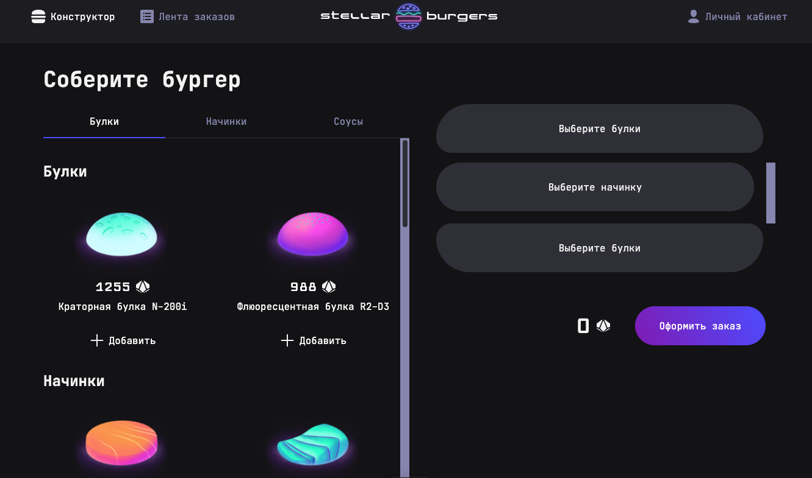

# Stellar Burger

Веб-приложение бургерной "Stellar Burger" с возможностью сделать заказ

---

---

### Cтек:

---

  &nbsp
  &nbsp
  &nbsp
  &nbsp
  &nbsp
  &nbsp
  &nbsp
  &nbsp
  &nbsp
  &nbsp
  &nbsp

### Над проектом работал:
<h3><a href="https://github.com/atvk" target="_blank">Стебловский Антон</a></h3>

---

### Ссылки на проект

- Адрес репозитория: https://github.com/atvk/stellar-burgers
- Деплой https://stellar-burgers-indol.vercel.app
